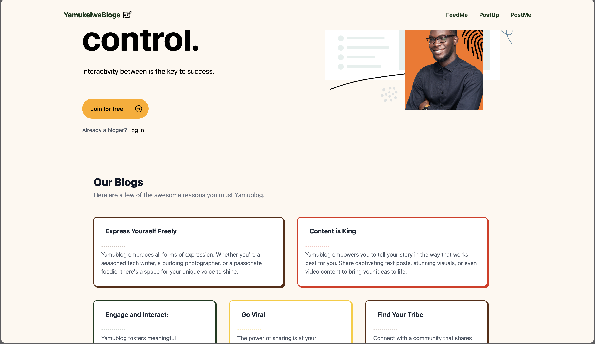

#### Yamublogs version 2

###### Date Started: 06/04/2024

###### Last Updated: 06/20/2024

###### Deployment: Netlify

###### Get Started with React: [what to do ?](https://github.com/fullstacktutorials/install-reactjs)

---

###### Tech Stack: ReactJS Redux-toolkit Tailwind API

---

##### Welcome to Yamublogs v2! If you're here, you're checking out how to make your blog much better and you can rest assured that you come to the right place. Feel free to explore, and remember, the code is yours to adapt and use however you like. Enjoy!

---

---

###### Features:

##### - Responsive design that adapts to different screen sizes.

##### - New Improved UI.

##### - Can now add your name to your comment.

##### - New Feed.

###### Process:

##### - Started with my Yamublogs v1.

##### - changed my state management to use redux toolkit.

##### - Improved sections with future implementations of a sign/log in.

##### - improved Feed design.

##### - Added name next to comments.

###### Learnings:

##### - Gained a deeper understanding of React JS.

##### - Improved skills in Redux & Tailwind

